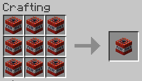

# brittle-bedrock
A Minecraft datapack: weaken bedrock with dense TNT explosions.

## Content
- Craft _Dense TNT_ with 9 normal TNT.  
  
- Place _Dense TNT_ on bedrock to weaken it.

## Technical Concept
- The advancement is triggered when a TNT item is placed on a bedrock block, but only if the TNT item has the custom data component added by the crafting recipe.
- Then, the advancement triggers a raycast from the player's head to determine the position of the newly placed TNT block.
- The TNT is replaced with primed TNT with a 0-tick fuse (instant explosion), and all neighboring bedrock blocks are replaced with obsidian.
- The raycast extends up to 5 blocks (normal placement range) in 0.1 block increments, for a maximum of 50 steps.
- There can be instances where the raycast does not find the TNT block. For example, this can happen when the cursor is at the very edge of the Bedrock block, and the 0.1-block steps are not fine-grained enough.
- When custom TNT is placed (not against bedrock), broken, and picked up again, it reverts to normal TNT, losing the custom data component.
